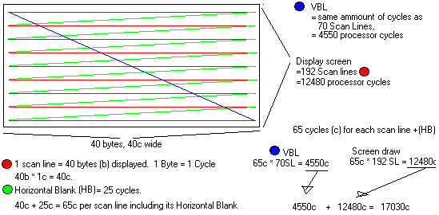

# Apple II video timing

This article I've taken from [this blog](http://rich12345.tripod.com/aiivideo/vbl.html) and simply converted it to markdown for cleaner reading.

## Explanation of drawing



The above drawing has an exaggerated, magnified view of the Apple II video screen being drawn.

Each Scan Line is represented by a red line.  The "Horizontal Blanks", or path the gun takes to get to the next line down, is represented by green.

There are 192 scan lines on an apple II screen.  You can get the point from the ammount I drew because each scan line is exactly the same.

The blue line is the VBL.  VerticalBlank period is the time when the gun is moving from the lower right of the screen, back up to the upper left to start drawing the screen again.

## Apple II video timing

The Apple II processor runs exactly 17030 cycles for each time the video screen is updated.

## Scan Lines

A scan line is a horizontal line drawn on the screen by the gun.  

Each scan line takes 65 cycles to 'draw'

```
40 bytes (7 bits diplayed in each byte.)
40*7 = 280 (HGR screen horizontal size )
```

1 cycle each byte, plus 25 cycles for gun to move down to next line ("Horizontal Blank") `40 X 1c + 25c = 65 cycles` for each scan line

`192SL * 65c = 12480` cycles to draw entire screen

It takes 17030 cycles for the gun to end up in the same place on the screen.

192 scan lines (HGR screen vertical size)

### Vertical BLank period

`17030 - 12480 = 4550 cycles.`

It takes the gun 4550 cycles to move from the lower right hand corner of the screen back up to the upper left.  This is called the Vertical BLank period. It can be detected at `$C019`.  

`$C019` Bit 7 of this location will be a 0 when the video beam is in the vertical retrace region.

You can test this from Assembly language using the `BMI` and `BPL` instructions. You could test from BASIC by seeinf if `$C019 > 127`, but VBL is happening fast and BASIC isn't really fast enough to do anything with VBL.

### Unverified informaiton

The value at `$C054` (and lots of the other video switches) are equal to the byte being displayed (this was posted to the Apple II newsgroup by Nathan Fisher)

What could you use it for?  Does this mean the actual VALUE that is stored at a certain location?  (255 is stored at `$2000`.  When being drawn to the screen by the video circuitry, does this mean `$C054 = 255`?)

Let me know anything else about the Apple II video timing, and I'll add it to the page.

`RDVBLBAR = $C019 ;not VBL (VBL signal low)`

ReaD Vertical BLanking (active low). Bit 7 of this location will be a 0   when the video beam is in the vertical retrace region. This can be used   to force updates of the video screen to be synchronised with the 50/60Hz   refresh - ie you will never get a screen with half old data and half new displayed. It can also be used to allow fancy split screen effects (ie 1/3 HIRES, 1/3 TEXT, 1/3 LORES or other combinations). It is not a softswitch, rather it is a status flag.

I agree with David's description, but I just wanted to add the following points about RDVBLBAR:

1. It doesn't exist on the original II or II+, only the IIe and IIgs. 
2. The //c uses this location for a different but related purpose: reading it returns a "VBL interrupt pending" flag and clears the flag. I think the polarity is inverted from the IIe: bit 7 set indicates that VBLInt is pending. You can't safely use this if the mouse firmware is active, because the mouse requires VBL itself.
3. If you have a mouse card in a II, II+ or IIe, it can be used to generate a vertical blanking interrupt. The same facility is provided by the mouse firmware in the IIc and IIgs.
