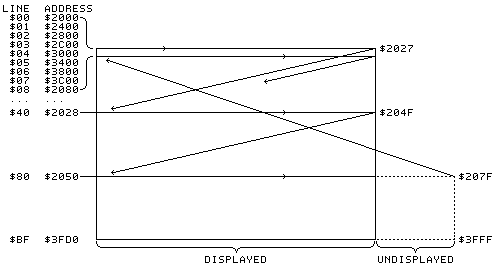

## Have an Apple Split

by Bob Bishop - Softalk, October 1982


Have you ever wanted to create a display with both lo-res graphics and hi-res graphics on the same screen? Or graphics with more than just four lines of text at the bottom? Or how about text with four lines of graphics?


As we all know, the Apple II has only five display formats. It can display all lo-res graphics, all hi-res graphics, all text, lo-res with four lines of text at the bottom, or hi-res with four lines of text at the bottom. The latter two formats are sometimes called mixed modes because they allow, in a very restricted way, the mixing of graphics and text. But, according to page 12 of the *Apple II Reference Manual*, "There is no way to display both graphics modes at the same time." Well, not only are there ways of displaying both graphics modes on the same screen, it is also possible to display any combination of modes!


The technique of mixing display modes by the process of *screen splitting* is familiar to programmers who've used the Apple III, the Atari 400 and 800 machines, and several other computers. These machines contain special hardware that helps detect what is referred to as *vertical blanking* and *horizontal blanking*. What is not generally known is that the blanking can be detected by the Apple II, even though it lacks the special hardware found in those other machines. 


### Example Program

Before jumping into a technical discussion of the hows and whys of screen splitting, let's look at an example of screen splitting on the Apple II. **Listing 1** and **listing 2** present a short Applesoft main program and a machine language subroutine that the program calls. 

```
100 HOME
200 FOR K = 0 TO 39
210 POKE 1448 + K, 14 * 16
220 POKE 2000 + K, 10 * 16
230 COLOR= K + 4
240 VLIN 25,45 AT K
250 NEXT K
300 VTAB 6: HTAB 17
310 PRINT "APPLE II"
400 CALL 768
500 GOTO 400

Listing 1.
```

```
0300- 8D 52 C0  STA $C052
0303- A9 E0     LDA #$E0
0305- A2 04     LDX #$04
0307- CD 51 C0  CMP $C051
030A- D0 F9     BNE $0305
030C- CA        DEX
030D- D0 F8     BNE $0307
030F- A9 A0     LDA #$A0
0311- A2 04     LDX #$04
0313- CD 50 C0  CMP $C050
0316- D0 F9     BNE $0311
0318- CA        DEX
0319- D0 F8     BNE $0313
031B- 8D 51 C0  STA $C051
031E- 60        RTS

Listing 2.
```

Take a few moments now to turn on your Apple and enter these two programs.  Don't worry if you don't understand machine language. Just go into the Monitor from Basic by typing `call-151` followed by the return key. Then start typing in the hexadecimal values for the **listing 2** subroutine that starts at `$0300`:

```
300:8D 52 C0 A9 E0 A2
```

and so on followed by the return key.

Now run the Applesoft program. What do you see? (Nothing, if you didn't type in the listings correctly.) You should see a text message in the top half of the screen and lo-res color graphics in the bottom half. This is a display mode that's supposed to be impossible to create on a standard Apple II computer!

To understand how to do screen splitting on the Apple II, you must be familiar not only with 6502 machine language but also with how the Apple maps its memory onto the display screen. (The latter information can be found on pages 14 through 21 of the *Apple II Reference Manual*.) The essence of what we need to know about hi-res in particular is shown in **figure 1**. Each line of the display is forty bytes long from left to right, and there are 192 such lines from top to bottom. The memory mapping seems somewhat haphazard: consecutive memory locations don't map onto consecutive lines of the display. Finally, for each set of 128 bytes of display memory only 120 bytes (three lines' worth) are displayed. The remaining eight bytes of the 128-byte set are never seen and are therefore sometimes referred to as the "undisplayed" or "unused" bytes. These undisplayed bytes all lie, conceptually, just off the bottom right-hand edge of the display, as shown in **figure 1**.



**Figure 1.** Memory mapping of bytes on hi-res page.

Text and lo-res both map in a way similar to hi-res, except that each cluster of eight lines now comes from one set of forty bytes instead of eight sets, and instead of the screen buffer being located at `$2000` through `$3FFF` it lies at `$0400` through `$07FF`. (Compare the *Apple II Reference Manual* pages 16 and 18 with page 21.)


### Some Preliminary Insights.

Let's try a few experiments that might give us some clues as to how screen splitting can be accomplished. From Basic type the command `call -151` (followed by return) to get into the Monitor. Next, clear the screen by issuing the `escape--shift-P` sequence. Now type `C051` followed by return. (Hitting return will always be assumed from now on.) The computer will probably display: 

```
C051- A0
```

(If it doesn't, try typing `C051` again.)

Typing `C051` from the Monitor is the way to turn on text mode if the computer is displaying graphics. But since we're already in text mode, nothing much happens--nothing much except that the contents of `$C051` are displayed. But `$C051` isn't supposed to be a readable address; it's merely a screen switch. So what does it mean for `$C051` to contain `$A0`? Is it just a coincidence that `$A0` is the hex code for an ASCII blank, and that most of the screen is also blank? What would happen if we typed `C054`? Or `C056`? Again, we tend to get `$A0` if the screen is mostly blank.

Let's try another experiment. Again from the Monitor, type: 

```
2000:73 2001<2000.3FFEM
```

followed by.

```
C050 C053 C057
```

You should see some vertical hi-res lines with space for four lines of 
text at the bottom of the screen. Now type *C050*, or *C053*, or 
*C054*, or *C057*. Most of the time we now see `$73` in the screen switch locations, and once in a while we see `$A0`. (Remember that the bottom four text lines on the screen are mostly blank.)

The results of the previous experiments suggest that by examining the screen switches we can somehow read the contents of at least part of the screen currently being displayed. But, to determine the time-history of what is being read, we must first find a way to "tag" the screen data and then sample the soft switches very quickly. Doing this would provide us with a cycle-by-cycle map of how the Apple's video is generated. In other words, we could determine which locations in memory the information in the screen switches is coming from during each clock cycle of the processor. Such a cycle-by-cycle map would be extremely useful in the implementation and understanding of screen splitting on the Apple II.

### Tagging and Sampling a Hi-Res Screen.

Now let's create a special hi-res display. We'll put zeros in the forty bytes of the hi-res memory buffer that correspond to line 0 and ones in all the bytes corresponding to line 1. Line 2 will contain all twos, and so on. In other words, line n will contain all n's, for n = 0 to 191 (`$00` to `$BF`). But we still haven't tagged the undisplayed bytes in the bottom right-hand corner (screen lines 128 through 191). Let's fill these sixty-four sets of 
eight-byte "invisible" lines with the values `$C0` through `$FF`. Then every byte in the primary hi-res display buffer (`$2000` through `$3FFF`), whether displayed or not, will contain a known quantity from `$00` to `$FF`. 
**Listing 3** is a program for creating such a hi-res display of tagged screen data. Two versions are given; one in Integer Basic and one in Applesoft. Use Integer if you have it. It's faster.

```
100 FOR Y = 0 TO 191
110 GOSUB 1000
120 FOR X = 0 TO 39
130 POKE BASE + X,Y
140 NEXT X,Y
150 FOR Y = 128 TO 191
160 GOSUB 1000
170 FOR X = 40 TO 47
180 POKE BASE + X,Y + 64
190 NEXT X,Y
200 END
1000 L = Y:S = 0:Q = 0
1010 S = INT (L / 64)
1020 L = L - S * 64
1030 Q = INT (L / 8)
1040 L = L - Q * 8
1050 BASE = 8192 + 1024 * L + 128 * Q + 40 * S
1060 RETURN

Listing 3--Applesoft.
```

```
100 FOR Y = 0 TO 191
110 GOSUB 1000
120 FOR X = 0 TO 39
130 POKE BASE+X,Y
140 NEXT X,Y
150 FOR Y = 128 TO 191
160 GOSUB 1000
170 FOR X = 40 TO 47
180 POKE BASE+X,Y+64
190 NEXT X,Y
500 END
1000 BASE=8192+40*(Y/64)+1024*(Y MOD 8)+128*((Y MOD 64)/8): RETURN 

Listing 3--Integer Basic.
```

Next we need to devise a way of quickly and uniformly sampling a screen switch over and over and saving each sample for later study. One way of doing this might be with a program like the following.

```
LDX #$00
LOOP LDA $C050
STA $1000,X
INX
BNE LOOP
```

This program is very short and straightforward, but it suffers from two major flaws: first, it does not provide the fastest possible sampling (because of the time required for index register operations). Second, it allows only 256 data points to be sampled and stored. If we try to remedy the second flaw by changing the method of storage to `STA (indirect),Y` we not only aggravate the first flaw but introduce delays into the loop that cause us to generate unevenly spaced samples after every two hundred fifty-sixth fetch.

The best approach is to create a sampling program of the form:

```
LDA $C050
STA $1000
LDA $C050
STA $1001
LDA $C050
STA $1002
```

and so on. There's no loop involved; an individual set of `LDA` and `STA` commands is used for each check. Such a program is quite long (six bytes per sample) but executes very quickly (one sample per eight machine cycles) and yields uniformly spaced data. The programs in **listing 4** generate the machine language program just described. Again, use the Integer version if you have that language.

```
10 PC = 16384
20 POKE PC + 1,80: POKE PC + 4,82: POKE PC + 7,87
30 FOR K = 1 TO 3
40 POKE PC,141: POKE PC + 2,192
50 PC = PC + 3
60 NEXT K
100 FOR LOC = 32768 TO 34816
110 POKE PC,173
120 POKE PC + 1,80
130 POKE PC + 2,192
140 POKE PC + 3,141
150 HLOC = INT (LOC / 256)
160 LLOC = LOC - (HLOC * 256)
170 POKE PC + 4,LLOC
180 POKE PC + 5,HLOC
190 PC = PC + 6
200 NEXT LOC
210 POKE PC,141: POKE PC+1,81: POKE PC+2,192: POKE PC+3,96

Listing 4--Applesoft.
```

```
10 PC=16384: LOC=4096
20 LDA=10*16+13: STA=8*16+13: C050LO=5*16: C050HI=12*16: RTS=96 
40 POKE PC+1,C050LO: POKE PC+4,C050LO+2: POKE PC+7,C050LO+7
50 FOR K = 1 TO 3
60 POKE PC,STA: POKE PC+2,C050HI
70 PC=PC+3
80 NEXT K
100 FOR K=1 TO 2048
110 POKE PC+0,LDA
120 POKE PC+1,C050LO
130 POKE PC+2,C050HI
140 POKE PC+3,STA
150 POKE PC+4,LOC MOD 256
160 POKE PC+5,LOC/256
170 PC=PC+6: LOC=LOC+1
180 NEXT K
190 POKE PC,STA: POKE PC+1,C050LO+1: POKE PC+2,C050HI: POKE PC+3,RTS 

Listing 4--Integer Basic.
```

We're now ready for business. Having run the programs shown in **listings 3** and **listing 4**, we have the tagged hi-res data starting at `$2000` and the sampling program starting at `$4000`. We run the sampler by entering the Monitor and giving the command `4000G`. After a brief flash of the screen the program terminates, leaving its collection of screen samples starting at `$1000` in the Integer version or `$8000` in the Applesoft version. 

**Figure 2** is a partial listing of the key results of the sampling program. The entire listing of all the samples is much longer. Interested readers are encouraged to generate their own complete set of data using the programs described above. Before we can begin interpreting these results, we must discuss some fundamental concepts about television video and the Apple.

```
1120- B7 F7 37 37 37 37 B8 B8 
1128- B8 F8 38 38 38 38 B9 B9 
1130- B9 F9 39 39 39 39 BA BA 
1138- BA FA 3A 3A 3A 3A BB BB 
1140- BB BB FB 3B 3B 3B 3B BC 
1148- BC BC FC 3C 3C 3C 3C BD
1150- BD BD FD 3D 3D 3D 3D BE 
1158- BE BE FE 3E 3E 3E 3E BF
1160- BF BF FF 3F 3F 3F 3F BA
1168- BA BA FA 3A 3A 3A 3A BB 
1170- BB BB FB 3B 3B 3B 3B BC 
1178- BC BC FC 3C 3C 3C 3C BD
1180- BD BD BD FD 3D 3D 3D 3D
1188- BE BE BE FE 3E 3E 3E 3E 
1190- BF BF BF FF 3F 3F 3F 3F
1198- 80 80 C0 00 00 00 00 00 
11A0- 81 81 C1 01 01 01 01 01 
11A8- 82 82 C2 02 02 02 02 02
11B0- 83 83 C3 03 03 03 03 03 
11B8- 84 84 C4 04 04 04 04 04 
11C0- A5 85 85 C5 05 05 05 05 
11C8- 05 86 86 C6 06 06 06 06
11D0- 06 87 87 C7 07 07 07 07

1780- 7A 7A BA BA BA BA BA 7B 
1788- 7B 7B BB BB BB BB BB 7C 
1790- 7C 7C BC BC BC BC BC 7D
1798- 7D 7D 7D BD BD BD BD BD 
17A0- 7E 7E 7E BE BE BE BE BE 
17A8- 7F 7F 7F BF BF BF BF BF 
17B0- 80 80 80 C0 00 00 00 00 
17B8- 81 81 81 C1 01 01 01 01 
17C0- 82 82 82 C2 02 02 02 02 
17C8- 83 83 83 C3 03 03 03 03 
17D0- 84 84 84 C4 04 04 04 04 
17D8- A5 85 85 85 C5 05 05 05 
17E0- 05 86 86 86 C6 06 06 06 
17E8- 06 87 87 87 C7 07 07 07 
17F0- 07 88 88 88 C8 08 08 08 
17F8- 08 89 89 89 C9 09 09 09 

1970- B7 B7 F7 37 37 37 37 B8 
1978- B8 B8 F8 38 38 38 38 B9
1980- B9 B9 F9 39 39 39 39 BA
1988- BA BA FA 3A 3A 3A 3A BB
1990- BB BB FB 3B 3B 3B 3B BC 
1998- BC BC FC 3C 3C 3C 3C BD 
19A0- BD BD BD FD 3D 3D 3D 3D 
19A8- BE BE BE FE 3E 3E 3E 3E 
19B0- BF BF BF FF 3F 3F 3F 3F 
19B8- BA BA BA FA 3A 3A 3A 3A 
19C0- BB BB BB FB 3B 3B 3B 3B 
19C8- BC BC BC FC 3C 3C 3C 3C 
19D0- BD BD BD FD 3D 3D 3D 3D 
19D8- BE BE BE FE 3E 3E 3E 3E 
19E0- BF BF BF BF FF 3F 3F 3F
19E8- 3F 80 80 C0 00 00 00 00 
19F0- 00 81 81 C1 01 01 01 01 
19F8- 01 82 82 C2 02 02 02 02 

Figure 2.
```

## Television Images

A standard television picture consists of `525` interlaced scan lines that start in the upper left-hand corner of the screen and end in the bottom-right. "Interlaced" means that the image on the screen is created by first scanning all the even lines of the picture and then going back and filling in all the odd lines. In each scan line, the electron beam starts at the left side of the display and travels across the screen to the right, displaying one line of the image as it moves. When the beam finishes at the right end of each scan line, it shuts off for a few microseconds while it repositions itself at the beginning of the next line to be scanned. This shut-off period is referred to as *horizontal blanking* (HBL). When the beam reaches the bottom of the screen and finishes scanning the last line, it again shuts off, this time for a few milliseconds while it repositions itself at the top of the display for the next frame of the image. This second turn-off period is referred to as *vertical blanking* (VBL). The total time required to complete one interlaced frame (including VBLs) is one-thirtieth of a second.

When the Apple computer was first being designed, it was discovered that a computer-generated interlaced video signal produced a display that had an objectionable flicker. So interlacing was not used, even though this meant that half of the potential vertical resolution would be lost. This lost *spatial* resolution allowed Apple to achieve increased *temoral* resolution; instead of generating only thirty video frames per second, the Apple generates sixty, because the Apple uses the interlace to display a new 192-line frame.

A second design consideration in the Apple II was the decision not to overscan the screen. "Overscanning" means that the image extends slightly beyond the four edges of the screen so that the picture fills the entire viewing area. Instead, so that information in the corners won't be lost, the Apple leaves a small dark border of unused screen in all of its display modes. This further reduces the number of visible scan lines in each frame, so that only 192 lines remain in the display.

The Apple transfers its video data to the screen at a rate of one byte per machine cycle. Each scan line requires a total of sixty-five cycles from HBL to HBL. Since the Apple produces a forty-column display (forty byes per line), we can deduce that twenty-five cycles of each scan line are spent in a turned-off state and forty cycles are spent turned on. But even when the video is turned off, the screen switches can still be sampled. What will they contain? 

## Interpreting the Sampled Results

Let's return to **figure 2** to see what we can learn from our sampled data. Locations `$119B` through `$119F` all contain zeros. Our sampling program required eight cycles per sample. 

Consequently, the five samples represent forty machine cycles-exactly the duration of the visible part of one scan line.

Since the top line of our display was the only line containing all zeros. we infer that the data stored at `$119B` represents the beginning of a video frame. After three strange bytes (`$11A0-$11A2`) we see five ones in a row. These apparently represent the next scan line down, followed by three more strange bytes, and so on.

Well, if we've identified the data that isn't strange as representing the visible portions of the scan lines, then it follows that the strange bytes must be coming during HBL, and that HBL maps from `$81` lines ahead of the line just scanned. The fact that HBL seems to come from such a far-away place is confusing enough in itself, but why an odd number like `$81` instead of a nice power of two or something (like `$80`)? Something about these results doesn't feel right; they just don't seem to make any sense.

Well, our decision to attribute HBL to the *end* of a scan line was simply one of convention. Since HBL occurs *between* scan lines, we could just as easily have attributed it to the beginning of a scan line. 

Then our interpretation of the data in **figure 2** would be that a scan line consists of its visible forty-cycle component preceded by its invisible twenty-five-cycle HBL component, which is mapped from `$40` display lines earlier. This model assumes a circular screen; that is, if counting up `$40` lines would take you off the top of the screen, continue counting up from the bottom.

If we interpret the data in this fashion, it soon becomes evident that: *a complete sixty-five-cycle scan line consists of sixty-five consecutive bytes of display buffer memory that starts twenty-five bytes prior to the actual data to be displayed*. (See **figure 3**.) We can even see the undisplayed bytes of the screen buffer (where we stored the values `$C0` through `$FF`, remember?) in locations `$119A`, `$11A2`, and so on; they're right where we'd expect them to be.


**Figure 3.** Cycle-by-cycle map of video frame.

If we now look at locations `$17AB` through `$17AF` in **figure 2** we see that they all contain `$BF`, which represents the bottom line of the display. 

Thus `$17B0` must be the start of VBL. During VBL the data acts just as if it were starting a whole new frame from the beginning, but it never finishes this pseudo-frame. After getting one third of the way through the frame (to scan line `$3F`), it suddenly repeats the previous six scan lines (`$3A` through `$3F`) before aborting to begin the next true frame. Examine locations `$1970` through `$19FF` in **figure 2**.

If we had done our tagging and sampling exercise using a lo-res or text screen instead, the results would have been similar. The only difference would have been that each row of sixty-five bytes in the display 
would be repeated eight times, since both text and lo-res "characters" are eight scan lines tall.

## Example Program Revisited

Now that we have a better feeling for what's going on, let's go back and try to understand how the screen splitting example in **listing 1** worked.

The for-next loop in lines 200 through 250 does three things:

1. Line 210 pokes the value $E0 into the middle line of text/low-res display.
2. Line 220 pokes the value $A0 into the bottom line of the display. 
3. Lines 230 and 240 create a simple lo-res pattern of colored vertical lines.

After printing a text message (lines 300 through 310) in the top part of the screen, the program calls (in line 400) the machine language screen splitting subroutine located at $0300. Line 500 then keeps re-calling the subroutine so that screen splitting will continue. Screen splitting is a dynamic process; it requires a program to keep it working. If the program stops, screen splitting stops. Try hitting control-C and see what happens. 

Now let's examine the machine language subroutine. Ironically, one of the first things we have to do to produce a mixed mode display is to turn off the mixed mode screen switch, `$C052`. Since we'll be doing our own mixing we don't want the Apple to confuse things by putting in its own mode switching. The rest of the routine consists of two virtually identical polling loops.

The first loop (`$0305` through `$030E`) sets text mode by referencing screen switch `$C051` and, at the same time, waits for four consecutive `$E0`s to be scanned. Where do these `$E0`s come from? From the middle of the display screen where they were poked by line 210 of the Applesoft program! 

When the `$E0`s are detected, the subroutine enters the second pollng loop (`$0311` through `$031A`). This loop sets lo-res graphics mode by referencing screen switch `$C050` and then waits for four consecutive `$A0`s (from the bottom line of the display) to be scanned. Once the `$A0`s have been detected, the mode is set back to text (at location `$031B`) and the subroutine returns to the main program.

There are a few subtleties here that should be pointed out. Why, for example, do we require four consecutive occurrences of `$A0` and `$E0` instead of just one? The reason for this can be inferred from **figure 3**. We see that *every displayed line also has apart of itself mapped into some other display line's twenty-five-cycle "invisible" HBL component*. This complicates the problem of detecting where the beam is currently scanning on the display. How do we know whether the data being sampled is coming from a visible scan or from an invisible HBL? Well, a visible scan consists of forty cycles of data, while the invisible HBL can only be twenty-five cycles at most. So, by requiring several consecutive samples whose fetching times total more than twenty-five cycles duration, we will eliminate false triggerings from HBL. Be careful not to exceed forty cycles or you'll miss the visible data too.

The process of mode changing sometimes tends to produce small unsightly glitches on the display screen. To test this out, change the contents of location `$0305` in our example program in **listing 2** to be either a `$03` or a `$02` and see if it makes any difference in the display. You can see how it's a good idea to try to change modes during HBL (or VBL) rather than in the middle of a visible scan line.

Another subtlety in the example program lies in our choice of `$A0` and `$E0` as tag bytes. While any values could have been used as tags, the values `$A0` and `$E0` are especially useful because they both appear as blanks on a text screen. On a lo-res graphics screen they appear (in our example) as a row of black (or blank) over a row of color. Thus these values provide a convenient way of switching cleanly between text and graphics modes. 


## In Conclusion

From our examination of the example program, we see that screen splitting consists of essentially two steps. First, the screen must be preformatted with "tagged" lines at the points where screen splitting is to occur (that is, the `$A0` and `$E0` lines in our example). Second, a machine language subroutine must be written that detects these tagged lines and then quickly switches display modes. But the process is far from being trivial, and it requires a certain amount of creativity and ingenuity to design screens that can be split cleanly and effectively. What are some applications of screen splitting? Well, it can provide for a little more variety and flexibility in display modes above and beyond the basic five that everyone knows about. To this end I have used screen splitting to create the opening displays for several commercially available games (*Maxwell's Demon/Bishop's Square*, from Datasoft, Inc.; *Money Munchers*, from DataMost).

In addition to splitting a screen, we can superimpose screens. For example, if we print some words on the primary text screen and plot some lo-res colors in the corresponding locations of the secondary lo-res screen, then by screen switching, we could produce text on top of a colored background (if we don't mind a little bit of flicker). Similarly, by combining the two hi-res pages in such a way that the primary page has all of its high bits off while the secondary page has all of its high bits on, we can generate true 560 x 192 hi-res graphics. It is then possible to write a hi-res character generator for this mode that, in effect, produces eighty columns of text (in hi-res) without benefit of an eighty-column card!

The possibilities arising from screen splitting seem quite exciting, to say the least. But there is, unfortunately, one fly in the ointment--the technique may not work on all Apples. Looking at the screen switches like we've been doing is called "reading the floating bus," and it's something that Apple Computer never intended to be done. Therefore, they make no guarantees that the data read in this manner will be meaningful, especially when certain peripheral cards are plugged into the expansion slots. In fact, this method of screen splitting doesn't work on the Apple III at all, even in emulation mode, because its bus doesn't float. But there seem to be very few Apple IIs in which the method can't be made to work when the incompatible peripherals are unplugged.

If you can't get screen splitting to work on your Apple, you might want to try running the machine language program shown in **listing 5**. Load a hi-res picture into the primary display buffer (`$2000` through `$3FFF`), create any lo-res display on the primary lo-res screen, and then run the program at `$1000`.

```
1000- A2 00     LDX #$00
1002- 20 1A 10  JSR $101A
1005- 8D 50 C0  STA $C050
1008- 8D 57 C0  STA $C057
1006- F0 00     BEQ $100D
100D- 20 1A 10  JSR $101A
1010- 8D 52 C0  STA $C052
1013- 8D 56 C0  STA $C056
1016- EA        NOP
1017- 4C 02 10  JMP $1002
101A- A0 06     LDY #$06
101C- CA        DEX
101D- D0 FD     BNE $101C
101F- 88        DEY
1020- D0 FA     BNE $101C
1022- A2 9D     LDX #$9D
1024- CA        DEX
1025- D0 FD     BNE $1024
1027- 60        RTS

Listing 5.
```

This program is an example of screen splitting using nothing but timing loops. But there's no way to synchronize the splitting. So, each time you run the program, the split will occur at a different vertical position on the screen, depending on which scan line you just happen to catch the beam on. This program should work on all Apples.

-----------------------
*The author would like to thank D. Kottke, R. Nicholson, and B. Smith of Apple Computer for their helpfull discussions on Apple II video hardware and L. Grossberger of Eclectic Electric for her suggestions and help in preparing the diagrams for this article.*

