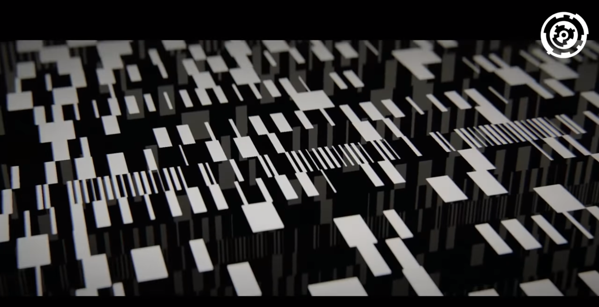
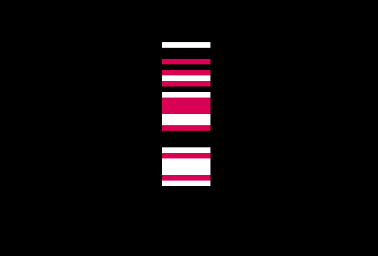
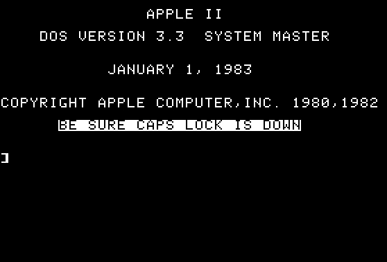
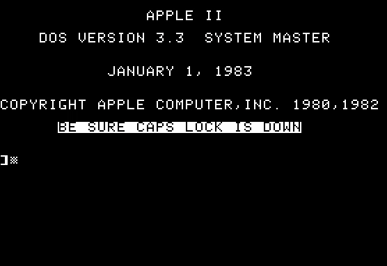

## 51 Byte Parallax Scrollbar Apple II demo

This is an idea I worked on for an effect on an Apple II. The seed came from watching this YouTube video of a collection of tiny BBCMicro demos [[YouTube]](https://www.youtube.com/watch?v=Hgn-evFqZas) and the **Brainwave** 64k Demo entry from Revision '19 [[YouTube]](https://www.youtube.com/watch?v=FYyL_mEQWOM&feature=youtu.be&t=1514). In particular this small section:



That part of the demo shows some scrolling bars with different speed and parallax. I wanted to get an idea of how fast the Apple 2 could render graphics using assembler in low res mode. I started with vertical bars (no way I'll attempt to do it diagonal!) and just a single row. I was interested in vertical since on the Apple 2 it makes for thinner bars. I tweaked a little bit and got it down to 175 bytes (I'm sure I can lower that number from my later experience but for the moment I might come back to this later). This is the result: 



After that I wanted to try to do this effect (or similiar) with as few bytes as possible. After making lots of tweaks I managed to get it down to 51 bytes. This is how it looks:



Finally to add some variations I created a third version which cycles through 4 colors. Here it is running:



I also uploaded a YouTube video with all them running [here](https://www.youtube.com/watch?v=zJpT-gt-ZO4). Here's the source for the 62 byte version.


## Notes for me:

- In Mame: 

```
cd /home/miquel/Develop/AppleII/roms/Roms Apple II - Mame 0.219;
mame -verbose -debug -rp . apple2c -flop1 ../../my-demos/bruno/bruno.dsk 
```

- In linapple:

```
linapple --conf linapple.conf --d1 bruno.dsk 
```
